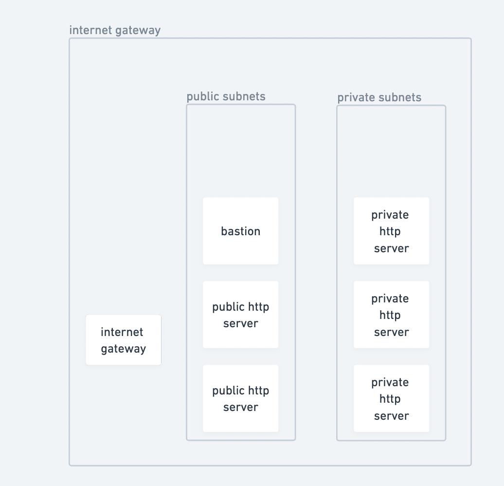

# redeploy the infrastructure

```sh
terraform init
terraform plan
terraform apply

output=$(terraform output -json | jq -r '.http_workers_ip.value')

private0=$(echo $output | jq -r '."private-http-server-0-private-dns"')
ssh -F ./secrets/config -o UserKnownHostsFile=/dev/null bastion "curl $private0:8080"

public0=$(echo $output | jq -r '."public-http-server-0-private-dns"')
ssh -F ./secrets/config -o UserKnownHostsFile=/dev/null bastion "curl $public0:8080"
```

# current state


